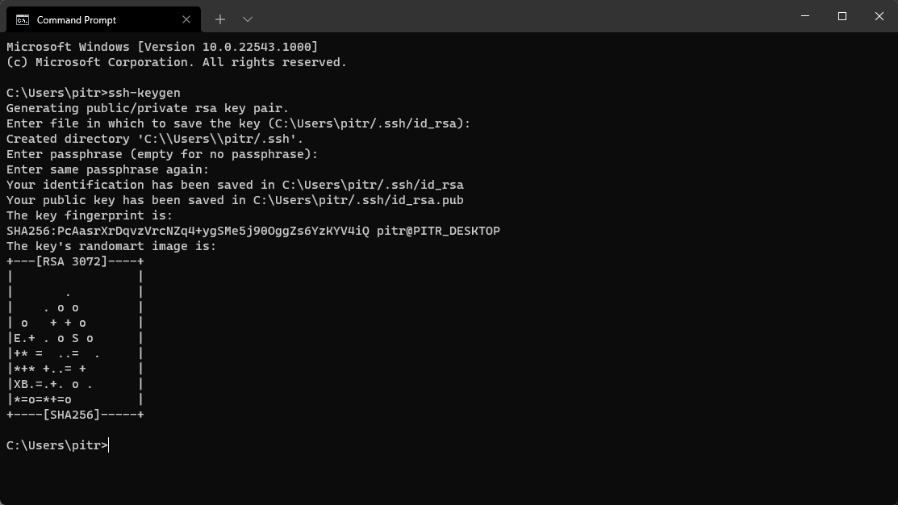

# Beta Prerequisites

## Creating a GitLab account

If you don't have a GitLab account, you can create one [here](https://gitlab.com/users/sign_up).

## Installing Git

If you don't have Git installed, you can download it [here](https://git-scm.com/downloads).

Make sure that the Git LFS box is checked during the installation.

## Creating an ssh key

If you don't have an ssh key, you should create one right now. [Guide](https://docs.gitlab.com/ee/ssh/#generate-an-ssh-key-pair)

:::info

Your key **CANNOT** have a passphrase. If it does, you will have to remove it and create a new one.

:::

Open the command prompt and type: `ssh-keygen`

The default settings should be fine, so feel free to keep pressing enter.

## Adding the ssh key to your account

Copy the contents of the `id_rsa.pub` file into your clipboard.

By default, it should be in the `.ssh` folder located in your user directory.

Next, go to this [GitLab page](https://gitlab.com/-/profile/keys) and paste the contents of the `id_rsa.pub` file into the `Key` field and click `Add key`

## Joining the testers group

As of now, all the repositories needed for Tundra are private. You will have to be manually added to the testers group.

Otherwise you will be unable to proceed.

## Setting up Tundra

[Tundra Quick Start](editor-setup)
