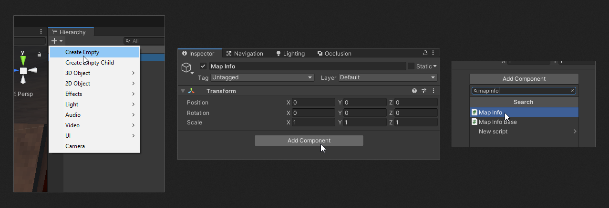
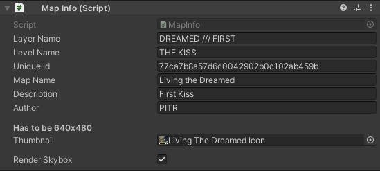
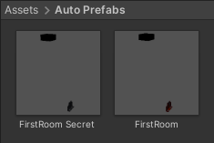
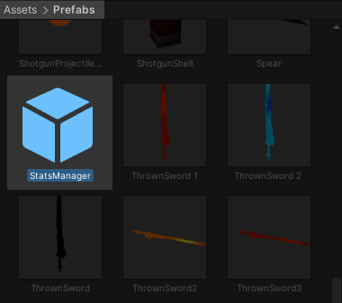

# Setup

There are a couple of things that you have to get done before you can start making your map.

## Map Info

Every Tundra map needs a Map Info component.

The best way to go about it is to create a new empty GameObject and add MapInfo to it.

That should leave you with a mostly Map Info component.
Next, click the `Generate an Id` button and fill in the rest of the details. You can leave the thumbnail empty for now.

## First Room

Auto prefabs, or placeholder prefabs are special. You can **not** modify them, because the game will replace them with the actual functional version.

The First Room and its variations are the most important placeholder prefabs. Drag either one into your scene, and preferably make sure that its position is set to 0, 0, 0.

The secret variant doesn't have a shop, and so you can use it to enforce or force disable certain weapons. (TODO)

## Stats Manager

StatsManager is the second prefab required to make your map functional. Drag and drop it into your scene as well.

You can modify it or its children to change some things about your map, such as the music.

**Don't** use the Unity Overrides function, keep the changes in the scene file instead of the shared StatsManager file.
